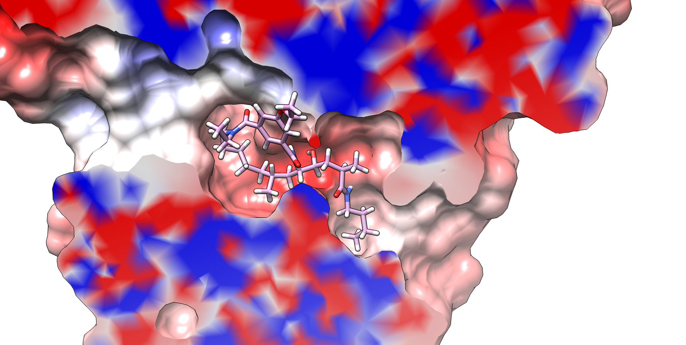

# CALCULATE AND VISUALIZE THE ELECTROSTATIC POTENTIAL OF A GLOBULAR PROTEIN

#### NOTE: I strongly recommend installing the latest versions of PDB2PQR and APBS from [https://github.com/Electrostatics/apbs-pdb2pqr.git](https://github.com/Electrostatics/apbs-pdb2pqr.git).

In this example we will calculate the electrostatic potential (**EP**) of BACE protease, one of the target of [D3R Grand Challenge 2018](https://drugdesigndata.org/about/grand-challenge-4).
All compounds in the BACE free energy set of D3R Challenge 2018 had a charge of +2 at the assay pH values of 4.5. Therefore we shall calculate the electrostatic potential  at this pH.
```
pH=4.5
pdbID=3K5C-BACE
pdb2pqr.py --ff=CHARMM --apbs-input --with-ph=$pH --chain ${pdbID}.pdb ${pdbID}.pH${pH}.pqr
```
this will create an input file for APBS named '3K5C-BACE.pH4.5.in'

Launch APBS
`apbs ${pdbID}.pH${pH}.in --output-file=${pdbID}.pH${pH}_APBS.log`
this will create a density file with the electrostatic potential named '3K5C-BACE.pH4.5.pqr.dx'


To view the EP on the protein surface load the receptor pqr file `3K5C-BACE.pH4.5.pqr` on [UCSF Chimera](https://www.cgl.ucsf.edu/chimera/) and display the surface by **Actions->Show->Surface**. If that fails try to adjust the vdw raddi by:

`vdwdefine +.05`

or to add hydrogens with the command

`addh`

and then select **Surface/Binding Analysis->Electrostatic Surface Coloring**, and under **potential file** select the .dx file. I will leave the default values, namely the surface will be colored with a color scale from -7 eV to 7 eV, with red representing negative charge, white neutral and blue positive. The charge value shown is that on the solvent
accessible surface of the protein, namely 1.4 Å far from the surface.

Now we will try to focus on the binding pocket. Load the ligand file `3K5C-BACE_1.mol` and use the **Tools->Depiction->Per-Model Clipping** utility to make tomographies of the EP map while mentaining the cartoon representation of the protein. Experiment with **Enable clipping** and **Adjust clipping with mouse as below** options both activated. Use the middle and right mouse buttons to rotate and shift the clipping place, respectively.
Optionally, you can create a nice cartoon representation of the protein and ligand:
```
ribspline cardinal smoothing both stiffness 0.8
ribrepr edged
set silhouette
set silhouette_width 2
set dcstart 0.3
background solid white
```
In the case of BACE, the binding pocket is covered by a a loop ("beta turn") therefore it is better to hide the ribbons for clarity.
`~ribbon`
Now we are ready to write an image file. Go to **File->Image**, select the image name and type and save it!




Once your're done, you can save your session at **File->Save Session as**. When you reopen it with Chimera you might get an error saying:
`"Could not restore surface color on surface model with id 0.1 because volume used in coloring was not restored."`
To fix it simply go to **Surface/Binding Analysis->Electrostatic Surface Coloring** and click on **color** button.


