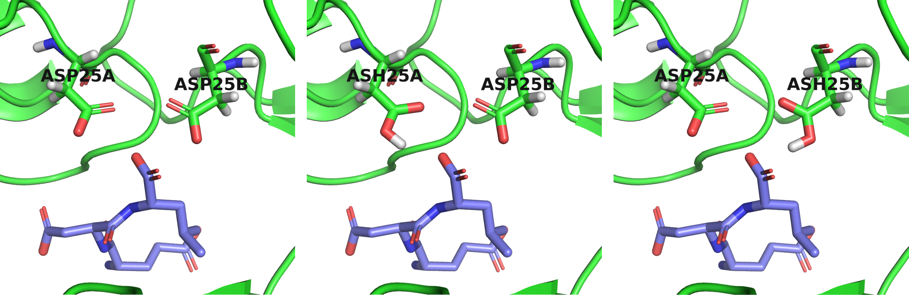

# CREATE ALTERNATIVE PROTONATION STATES OF A RECEPTOR

This is a Python script to create all alternative protonation state combinations of a protein given a ligand and a specified radius. It could be useful in case you have a receptor but you are not sure about the protonation states of some residues in the binding site and you want to do docking, MD, or any other structure-based drug design method using all of alternative receptor protonations.

The script must be executed with [PyChimera](https://pychimera.readthedocs.io/en/latest/), a Python wrappen of [UCSF Chimera](https://www.cgl.ucsf.edu/chimera/), which searches for protonatable standard residues (ASP, GLU, HIS) around the ligand, finds all possible combinations of protonation states, and writes a pdb file for each combination. Since the number of combinations of more than 6 protonatable residues becomes very large, the user can fix some residues to a give protonated/unprotonated state. See the tutorial below. You can also get the example usage by typing `protonate_receptor.py -h`.

## INSTALLATION
```
conda create -n ete3 -c insilichem pychimera
conda activate ete3
pychimera -c "import ete3"
pip install --upgrade numpy
```

## TUTORIAL

Download the pdb structure of HIV-1 protease complexed with a tripeptide inhibitor from [PDB](https://www.rcsb.org/structure/1A30). Save the receptor coordinates to file "1a30_receptor.pdb" and the ligand coordinates to a file "1a30_ligand.sdf". Then, list all protonatable residues within 4 Angstroms from the ligand.

`pychimera $(which protonate_receptor.py) -rec 1a30_protein.pdb -lig 1a30_ligand.sdf -r 4.0 -list`

You should get that the protonatable residues are: ASP_25.B ASP_25.A ASP_29.A ASP_30.A. We want to keep ASP_29.A ASP_30.A fixed to the unprotonated state and create alternative protonations for all the rest (namely the catalytic dyad ASP_25.B and ASP_25.A).

`pychimera $(which protonate_receptor.py) -rec 1a30_protein.pdb -lig 1a30_ligand.sdf -r 4.0 -fix ASP_29.A -fix ASP_30.A`

The script will generate 4 files in the current directory, from which we are interested only in the following 3:
```
1a30_protein_ASP25A_ASP25B.pdb
1a30_protein_ASH25A_ASP25B.pdb
1a30_protein_ASP25A_ASH25B.pdb
```
which correspond to the structures shown in the figure below.


The doubly protonated catalytic dyad does not exist. In general, the acid driven catalysis requires that one of the members of the Asp dyad would be ionized in order to 
activate the water molecule for the nucleophilic attack, while the second member needs to be protonated in order to enhance the electrophilic nature of the substrate 
carbonyl group.
